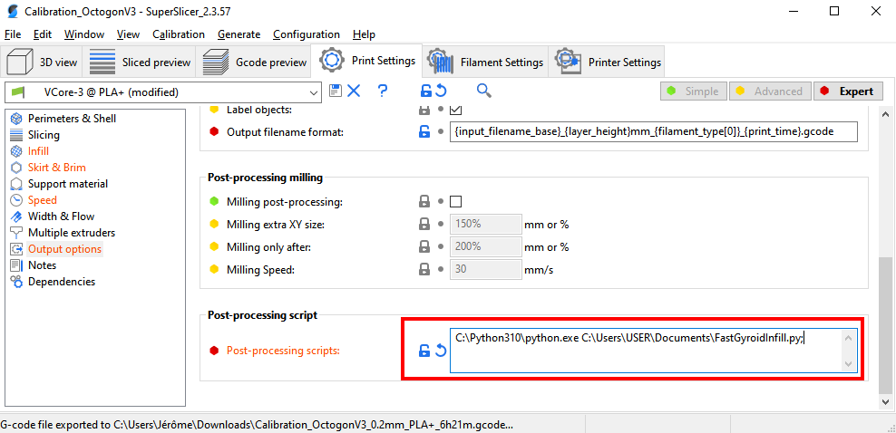

# Fast Infill for Klipper

This is a set of postprocessing scripts for [Cura](https://ultimaker.com/software/ultimaker-cura) and [SuperSlicer](https://github.com/supermerill/SuperSlicer) to accelerate the gyroid infill printing speed leveraging [Klipper](https://www.klipper3d.org/)'s Square Corner Velocity (SQV) feature.

It modifies the value of the SQV only for the infill keeping everything else default. Since the gyroid infill is made of curves, it prints slower by default because this is what the Square Corner Velocity feature does. Increasing this value too high for perimeters will remove details from your print.

This is why, being able to apply a different SQV value for the infill specifically will massively accelerate your prints when you use the gyroid infill while keeping the crisps details on everything else!

:warning: Use at your own risk :warning:

# How to use

## Klipper setup

This is mandatory, whatever the slicer you use:

1. Add the `save_variable` section to your `printer.cfg` if you don't already have it. For eg.:
    ```ini
    [save_variables]
    filename: ~/klipper_config/saved_variables.cfg
    ```
1. Copy the content of [`fast_infill.cfg`](klipper/fast_infill.cfg) into your `printer.cfg`
1. If you use a standard screen (not KlipperScreen), you can also add the content of [`menu_fast_infill.cfg`](klipper/menu_fast_infill.cfg). This will add 2 entries in your `Tune` menu to be able to set some values without going to the fluidd/mainsail interface
1. Once you have added the configuration to your klipper configuration, restart Klipper
1. When the machine is back online, run the command `SET_INFILL_SQV SQV=<VALUE>`. This will define the SQV value you want to use during the infill. I suggest a value of `20` if your printer is capable of going very fast (eg. Voron, RatRig VCore-3, ...).

You can update the SQV value for infill while it's printing by using the same command above. It will be applied during the next infill run. If you don't want to modify the infill SQV, just set the value to the same value as your default SQV.

## Cura

1. Copy the [`fastGyroidInfill.py` file](cura/FastGyroidInfill.py) from the repository's cura folder into your cura configuration folder -> scripts

    * For Windows, place this file in the folder `%APPDATA%\cura\<CURA VERSION>\scripts`
    * For Linux, place this file in the folder `~/.local/share/cura/<CURA VERSION>/scripts`
    * For MacOS, place this file in the folder `~/Library/Application Support/Cura/<CURA VERSION>/scripts`

1. Add the postprocessing script to Cura

    1. Extensions menu -> Post processing -> Modify GCode
    1. Add the `Faster Gyroid Infill with Klipper` post processing script

1. Slice your file as usual

## SuperSlicer

1. Copy the [`fastGyroidInfill.py` file](superslicer/FastGyroidInfill.py) from the repository's superslicer folder in a folder on your computer where superslicer runs. Put it in a folder without any space.
1. Install Python (if you are using Windows, don't install python from the Microsoft Store, it won't work)
1. Reference the post processing script into your superslicer configuration. Eg. for Windows:
    
1. Run your slicing as usual and export or upload the file to your printer. If everything works as ecpected, you'll see a black terminal window poping up (that is the script running).

# How to validates that it works well

If you open the gcode file after postprocessing, you should find references to `_USE_INFILL_SQV` and `_USE_NORMAL_SQV`.